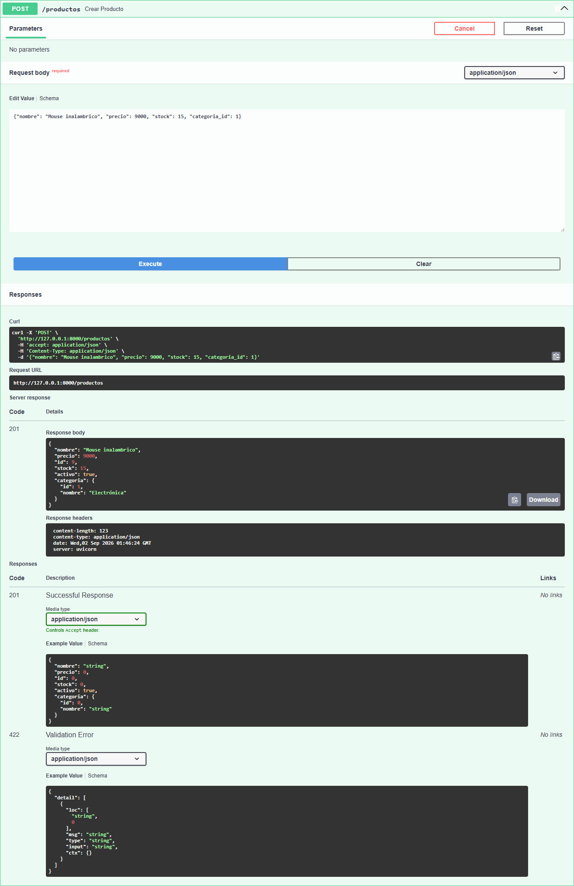
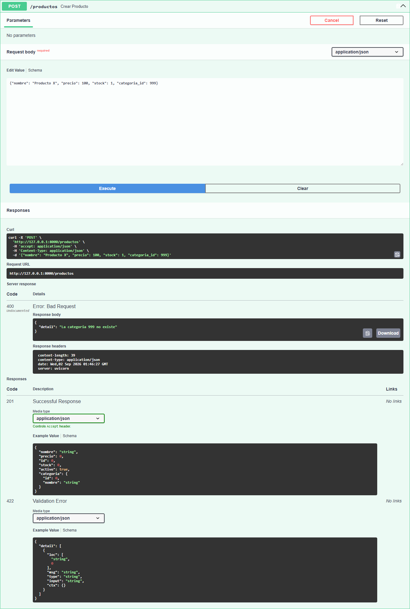
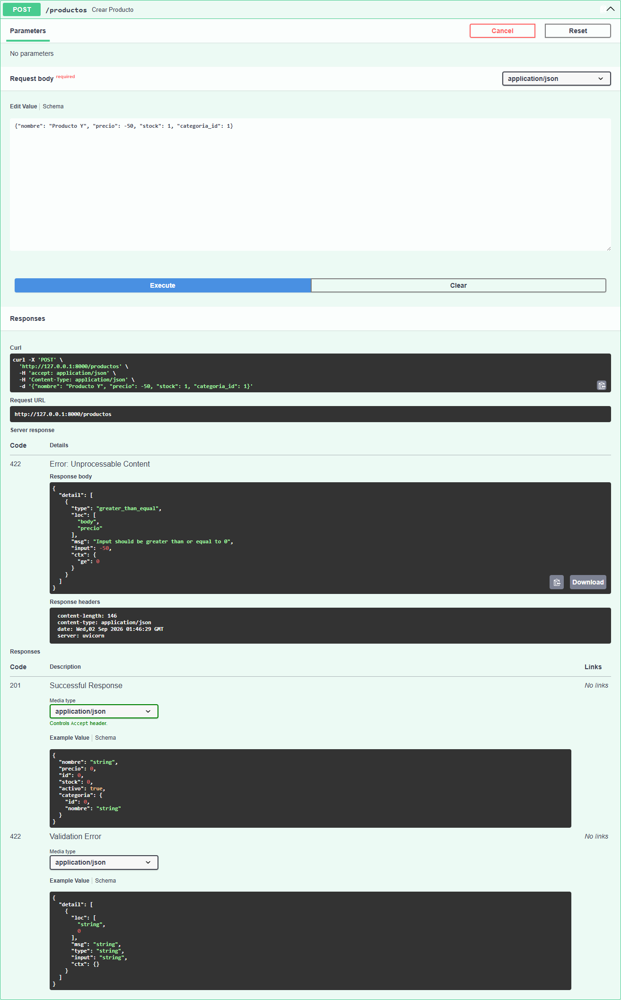
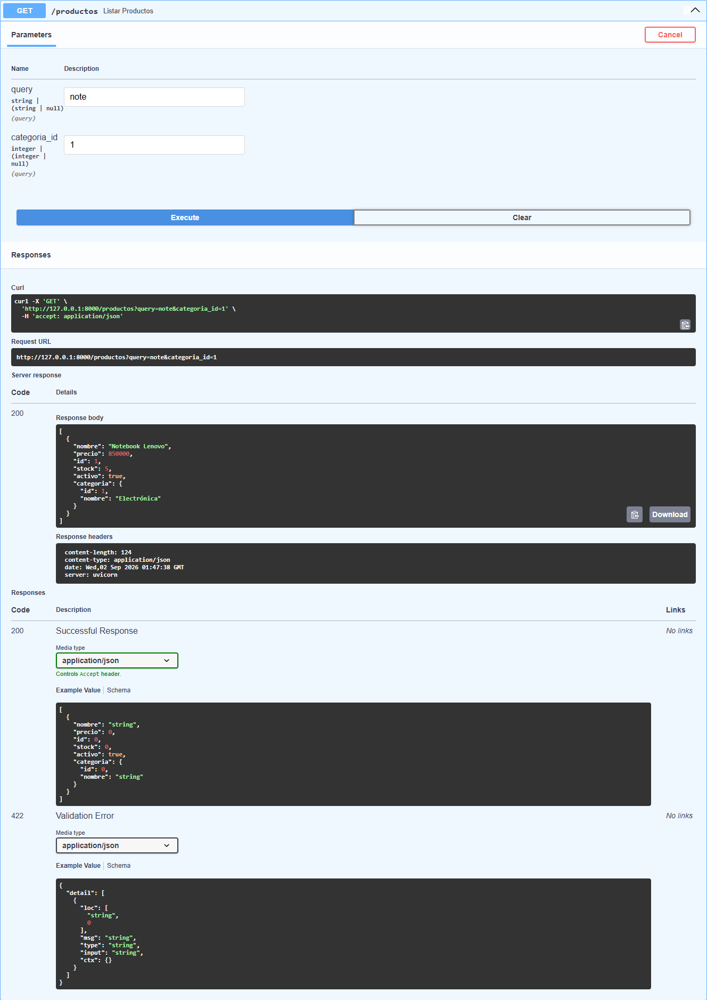
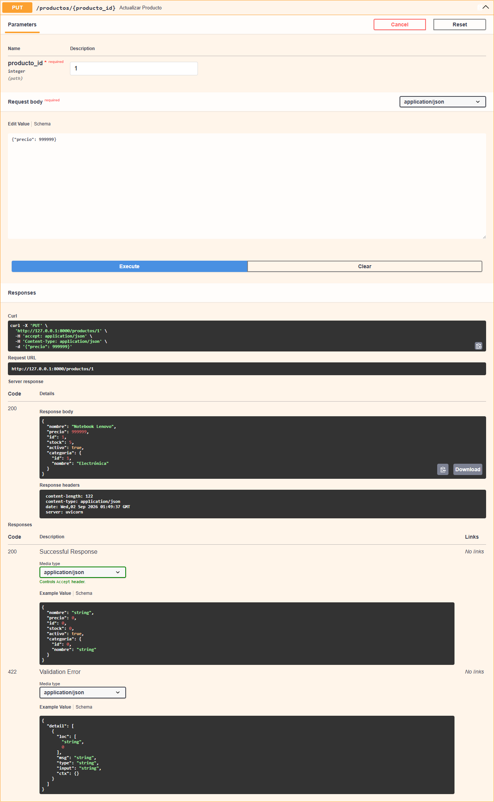
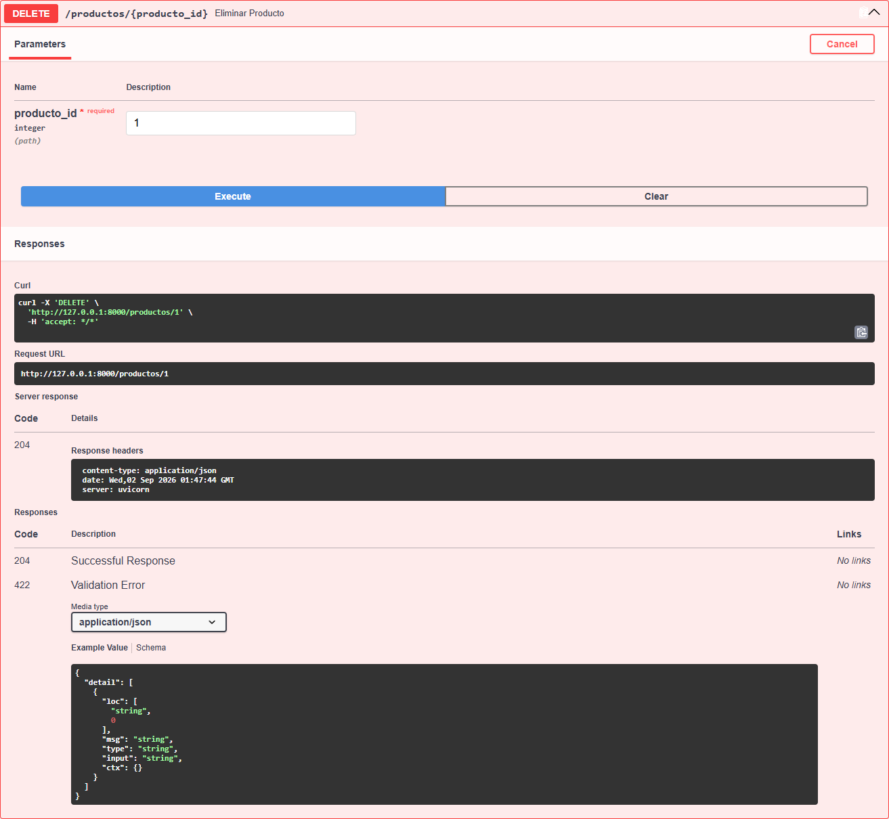
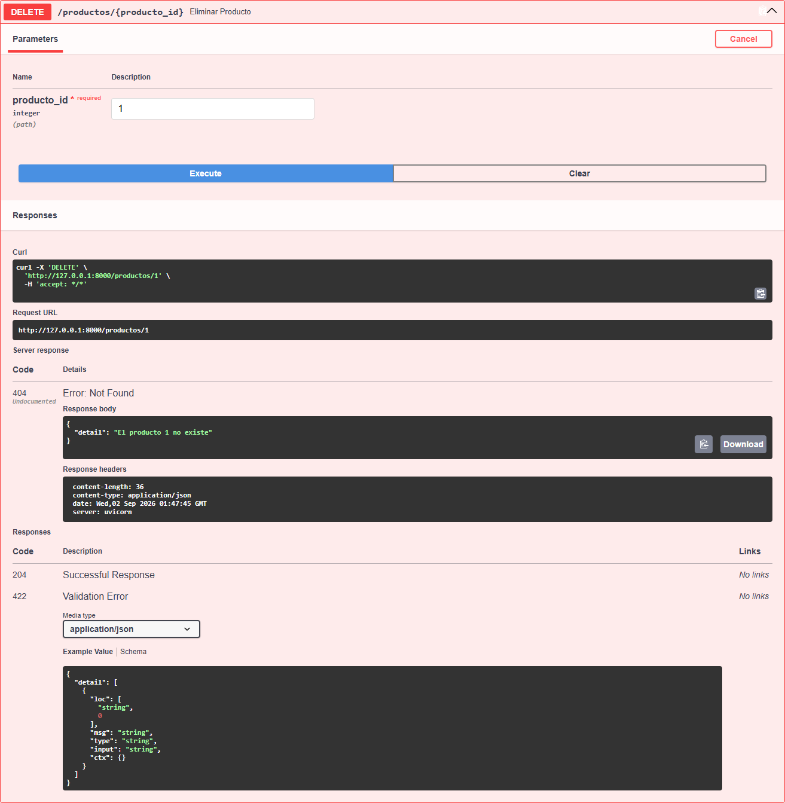

# TP Productos API

API REST para un catálogo de productos, construida con **FastAPI** siguiendo una
arquitectura de capas (`router` / `schemas` / `repository` / `models`). La base de
datos es una lista en memoria, pensada para migrarse a PostgreSQL más adelante en la
materia sin tener que reescribir la lógica de negocio.

## Integrantes

| Nombre | Usuario de GitHub | Parte del proyecto |
|---|---|---|
| Eileen | eileencross | Estructura de carpetas y modelos (`models/`) |
| Abigail | _completar_ | Base de datos en memoria (`core/db.py`) |
| Fernando | _completar_ | Schemas de validación (`schemas.py`) |
| Florencia | _completar_ | Repository, router y arranque de la app |

## Estructura de carpetas

```
tp-productos-api/
├── app/
│   ├── __init__.py
│   ├── main.py                     # crea la app y monta el router
│   ├── core/
│   │   ├── __init__.py
│   │   └── db.py                   # "base de datos" en memoria
│   ├── models/
│   │   ├── __init__.py
│   │   ├── categoria.py            # @dataclass Categoria
│   │   └── producto.py             # @dataclass Producto
│   └── api/
│       ├── __init__.py
│       └── v1/
│           ├── __init__.py
│           └── productos/
│               ├── __init__.py
│               ├── router.py       # endpoints /productos
│               ├── schemas.py      # Pydantic Base/Create/Update/Response
│               └── repository.py   # acceso a datos + validaciones
├── requirements.txt
├── README.md
└── .gitignore
```

## Cómo levantar el proyecto

```bash
cd tp-productos-api
python -m venv venv
venv\Scripts\activate        # en Linux/Mac: source venv/bin/activate
pip install -r requirements.txt
fastapi dev app/main.py
```

La API queda disponible en `http://127.0.0.1:8000`, y la documentación interactiva
(Swagger UI) en `http://127.0.0.1:8000/docs`.

## Endpoints

| Método | Ruta | Descripción | Status codes |
|---|---|---|---|
| GET | `/productos` | Lista productos, con filtros opcionales `?query=` y `?categoria_id=` combinables | 200 |
| GET | `/productos/{id}` | Obtiene un producto por id | 200, 404 |
| POST | `/productos` | Crea un producto (valida que la categoría exista) | 201, 400, 422 |
| PUT | `/productos/{id}` | Actualiza parcialmente un producto (`exclude_unset`) | 200, 404, 400 |
| DELETE | `/productos/{id}` | Elimina un producto | 204, 404 |

## Pruebas realizadas en Swagger UI

**1) Crear un producto válido → 201**



**2) Crear con `categoria_id` inexistente → 400**



**3) Crear con `precio` negativo → 422 (validación Pydantic)**



**4) Listar con filtro combinado (`?query=note&categoria_id=1`)**



**5) Actualizar solo el precio con PUT (el resto de los campos no cambia)**



**6) DELETE → 204, y repetir el mismo DELETE → 404**




## Próximos pasos

- Migrar `core/db.py` a una base de datos PostgreSQL real con SQLAlchemy + Alembic.
- Agregar tests automatizados.
